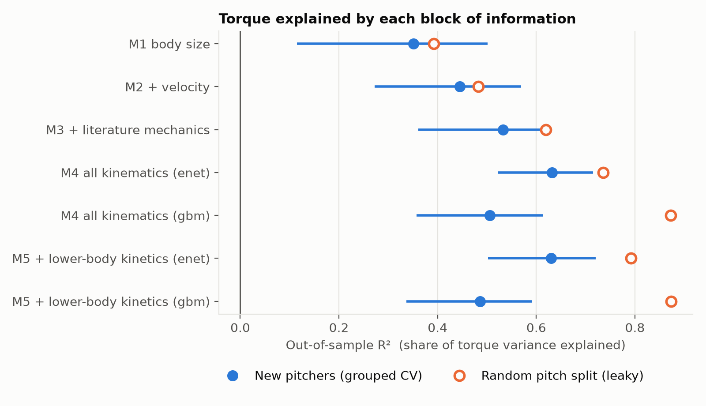
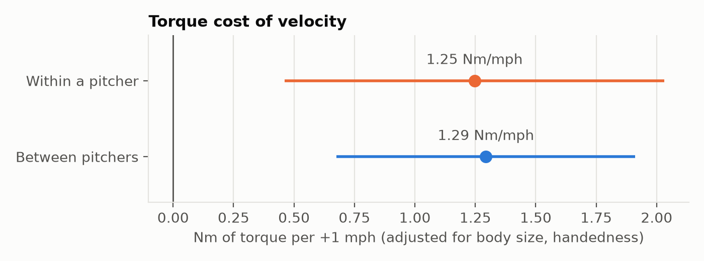
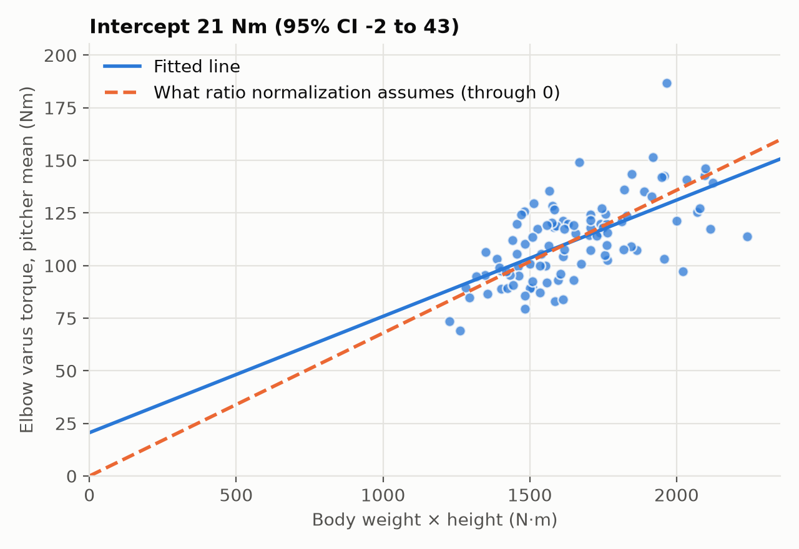

# Predicting elbow varus torque in pitchers the model has never seen

[](https://github.com/Andresperez397/obp-elbow-torque/actions/workflows/ci.yml)

## At a glance

- **Question:** How much of a pitcher's peak elbow varus torque can be predicted for a pitcher the model has never seen, and how much does the usual validation shortcut overstate it?
- **Answer:** Body size and velocity explain 45% of the variance in new pitchers; adding 42 kinematic measures reaches 63% (95% CI 52–72%). Split by pitch instead of by pitcher, boosted trees look like they explain 87%. On new pitchers they reach 51%.
- **Why it matters:** Any model built on repeated pitches per pitcher has to be validated on whole pitchers held out, or it will overstate what it can do for the next arm.
- **Start here:** [Two-page summary](reports/Elbow%20Torque%20Prediction%20-%20Summary.pdf) · [model ladder figure](reports/figures/fig1_model_ladder.png)


**What it is:** a pre-registered analysis of how much of a pitcher's peak elbow varus torque can be predicted from body size, velocity and mechanics. It also measures how badly the usual validation shortcut overstates the answer.

**Data:** 411 fastballs from 100 pitchers in the [OpenBiomechanics Project](https://openbiomechanics.org) (Driveline Baseball). Torque comes from marker-based motion capture (360 Hz) with force plates (1,080 Hz), processed by inverse dynamics.

**Author:** Andres Perez, M.S. Kinesiology (Biomechanics)



## Key findings

**1. Torque is a pitcher trait.**
- 95% of the variance in elbow varus torque lies between pitchers (ICC 0.95, 95% CI 0.93–0.96).
- Fastball to fastball, one pitcher's torque varies by a standard deviation of about 4 Nm. Between pitchers the standard deviation is about 19 Nm.
- So the useful prediction target is the *pitcher*, and validation has to hold out whole pitchers.

**2. On pitchers the model has never seen, adding mechanics raises explained variance from 0.45 to 0.63.**

Body size and velocity explain 45% of the variance. Adding the full set of kinematic measures (no kinetics) reaches 63%.

| Model (validated on held-out pitchers) | R² | 95% CI | RMSE (Nm) |
|---|---|---|---|
| Body size + handedness | 0.35 | 0.12–0.50 | 16.0 |
| + velocity | 0.45 | 0.27–0.57 | 14.8 |
| + 10 literature-chosen mechanics | 0.53 | 0.36–0.63 | 13.6 |
| **All 42 kinematic metrics (elastic net)** | **0.63** | **0.52–0.72** | **12.0** |
| All kinematics (gradient-boosted trees) | 0.51 | 0.36–0.61 | 14.0 |
| + lower-body kinetics and ground reaction forces (elastic net) | 0.63 | 0.50–0.72 | 12.1 |

R² and RMSE are averages over 20 repeats of 10-fold grouped CV. The 95% CIs come from a pitcher bootstrap of the first repeat (see *How the analysis was done*). At the pitcher level (each pitcher's mean torque against the mean prediction), the best model reaches R² 0.66.

Under the pre-declared rule, a block of information counts as adding something only if the 95% interval of its R² gain excludes zero:
- Velocity adds information over body size (+0.10, CI 0.02 to 0.20).
- The full kinematic set adds information: +0.19 over velocity (CI 0.10 to 0.30) and +0.12 over the literature subset (CI 0.04 to 0.22).
- The 10 literature mechanics on their own do not clear the bar (+0.08, CI −0.05 to 0.19).
- Lower-body kinetics and ground reaction forces add nothing on top of kinematics (−0.00, CI −0.08 to 0.06).

**3. Leaky validation inflates the result and reverses the model ranking.**
- If pitches are split at random, so a pitcher's other fastballs sit in the training set, gradient-boosted trees look like the best model (R² 0.87).
- On new pitchers the same model reaches only R² 0.51, worse than a linear elastic net.
- Under a random split, the trees can match a held-out pitch to that pitcher's other fastballs. That advantage disappears for a pitcher the model has never seen.
- Leakage inflation is 0.04 to 0.09 for ordinary least squares, 0.10 to 0.16 for the elastic net, and 0.37 to 0.39 for the trees. The elastic net still tunes its penalty with pitcher-grouped inner folds under the random split, so its inflation is a lower bound.

**4. Velocity costs about 1.3 Nm per mph, within and between pitchers.**
- Adjusted for body size and handedness, a pitcher who throws 1 mph harder than another carries 1.29 Nm more torque (CI 0.68–1.91).
- When the *same* pitcher throws 1 mph harder, torque rises 1.25 Nm (CI 0.46–2.03).
- Caveat: within-pitcher speed varied little (SD 0.5 mph in one session), so the within estimate is imprecise.



**5. Ratio normalization (torque ÷ body weight × height) is not rejected in this sample.**
- Pitcher-mean torque against BW×H has an intercept of 21 Nm (95% CI −2 to 43).
- The interval includes zero, which proportional scaling requires, but only barely.
- Normalized torque is weakly and not significantly correlated with BW×H (r = −0.15, 95% CI −0.34 to 0.04).
- So normalization is defensible here. The intercept test is cheap and worth running on any dataset before normalizing.



## How the analysis was done

- **The plan came first.** [`ANALYSIS_PLAN.md`](ANALYSIS_PLAN.md) fixed the questions, predictor blocks, models, metrics and decision rules. It was committed to git before any outcome model was fit, and the commit history shows the order. Post-hoc changes are logged in [`DEVIATIONS.md`](DEVIATIONS.md).
- **No leakage predictors.** Shoulder internal-rotation moment and the throwing-arm energy-flow terms come from the same inverse-dynamics solution as the outcome, so they are excluded.
- **Grouped validation.** 10-fold cross-validation by pitcher, repeated 20 times. All preprocessing (winsorizing, imputation, scaling) and elastic-net tuning (inner grouped CV) is fit inside the training folds.
- **Honest uncertainty.** 95% intervals come from 2,000 bootstrap resamples of pitchers (not pitches), applied to the out-of-fold predictions of the first repeat. The predictions are held fixed, so the intervals show how much the result depends on which pitchers were sampled. Repeat-to-repeat variation is small by comparison (SD of R² ≤ 0.03 across the 20 repeats).
- **Mixed models.** A random-intercept model gives the ICC, with a parametric-bootstrap CI. A within/between decomposition separates the two velocity effects.
- **Tests (15).** CI runs the 10 that don't need the raw data on every push; the other 5 run locally after `fetch_data.py`. `tests/` checks:
  - the join keeps every pitch
  - no outcome or leakage column enters any block, and the blocks are nested
  - grouped folds never share a pitcher
  - corrupting a held-out pitcher's torque can't change that pitcher's own prediction, for every learner
  - preprocessing uses training data only
  - the bootstrap resamples whole pitchers
  - the ICC estimator recovers a known value in simulation
  - the boosted trees run with the planned fixed settings (no hidden early stopping)

### Exploratory (not pre-registered): what the elastic net relies on

The table below comes from 500 pitcher-bootstrap refits of the all-kinematics model, using standardized predictors. It describes what the model leans on, not causal effects.
- The most stable predictors, holding the model's other inputs fixed, are body mass, velocity, and *lower* peak shoulder external rotation (layback).
- Next come glove-arm and throwing-arm shoulder abduction at foot plant, and trunk lateral tilt.
- See [`reports/tables/exploratory_enet_coefficients.csv`](reports/tables/exploratory_enet_coefficients.csv).

### Exploratory (not pre-registered): are the trees just untuned?

The pre-specified trees used fixed settings, while the elastic net was tuned, so I also tuned the trees (depth, learning rate, rounds, leaf size) with pitcher-grouped inner folds, on the same outer folds (5 repeats). Tuning helps the trees, from R² 0.51 to 0.55, but the elastic net still wins in all 5 repeats (0.63). See [`reports/tables/exploratory_tuned_gbm_summary.json`](reports/tables/exploratory_tuned_gbm_summary.json).

## Repository layout

```
ANALYSIS_PLAN.md      questions, models and decision rules, frozen before modeling
DEVIATIONS.md         every post-plan change, dated, with its reason
src/obp_evt/          data loading and predictor blocks, models and grouped CV, mixed models and bootstrap
scripts/              fetch_data, run_analysis, make_figures, exploratory_coefficients, exploratory_tuned_gbm
tests/                unit tests (pytest)
reports/              tables, figures, two-page summary (HTML and PDF)
```

## Limitations

- **Sample:** 100 mostly college pitchers (75 college, 12 independent, 7 high school, 6 MiLB), all tested in Driveline's lab, one session each, fastballs only. Do not assume the results transfer to MLB or in-game data.
- **The outcome is modeled:** torque is an inverse-dynamics estimate. Its level depends on a segment-inertia model that scales with body mass, so part of the body-size effect is built in by construction.
- **Small sample:** with 100 pitchers, the 95% intervals for R² gains span about ±0.1. That's why the literature subset's +0.08 doesn't count as a finding. Treat the confidence intervals as the result.

## Reproduce

Requires Python 3.11 or newer.

```bash
python -m venv .venv && source .venv/bin/activate
pip install -r requirements.txt
python scripts/fetch_data.py          # downloads the OBP files (not redistributed here)
python scripts/run_analysis.py        # about 5 minutes; writes reports/tables/
python scripts/make_figures.py
python scripts/exploratory_coefficients.py   # optional
python scripts/exploratory_tuned_gbm.py      # optional, about 20 min
pytest -q
```

## References

- Aguinaldo AL, Chambers H. Correlation of throwing mechanics with elbow valgus load in adult baseball pitchers. *Am J Sports Med.* 2009;37(10):2043-2048. [doi:10.1177/0363546509336721](https://doi.org/10.1177/0363546509336721)
- Fleisig GS, Andrews JR, Dillman CJ, Escamilla RF. Kinetics of baseball pitching with implications about injury mechanisms. *Am J Sports Med.* 1995;23(2):233-239. [doi:10.1177/036354659502300218](https://doi.org/10.1177/036354659502300218)
- Solomito MJ, Garibay EJ, Woods JR, Õunpuu S, Nissen CW. Lateral trunk lean in pitchers affects both ball velocity and upper extremity joint moments. *Am J Sports Med.* 2015;43(5):1235-1240. [doi:10.1177/0363546515574060](https://doi.org/10.1177/0363546515574060)
- Driveline Baseball. The OpenBiomechanics Project. https://openbiomechanics.org

## Licensing and attribution

- **Data:** The OpenBiomechanics Project, Driveline Baseball, [CC BY-NC-SA 4.0](https://creativecommons.org/licenses/by-nc-sa/4.0/) with an additional professional-organization exclusion (see the OBP license). The raw data are not redistributed here.
- **Derived results:** the tables and figures in `reports/` are derived works, shared under CC BY-NC-SA 4.0.
- **Code:** MIT (see `LICENSE`).
- This project is not affiliated with or endorsed by Driveline Baseball.
